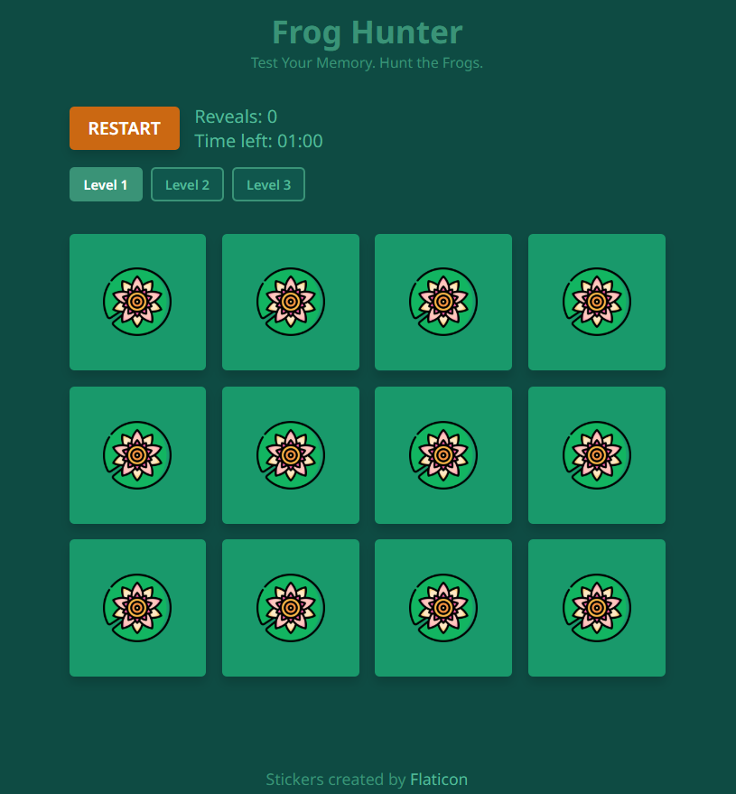
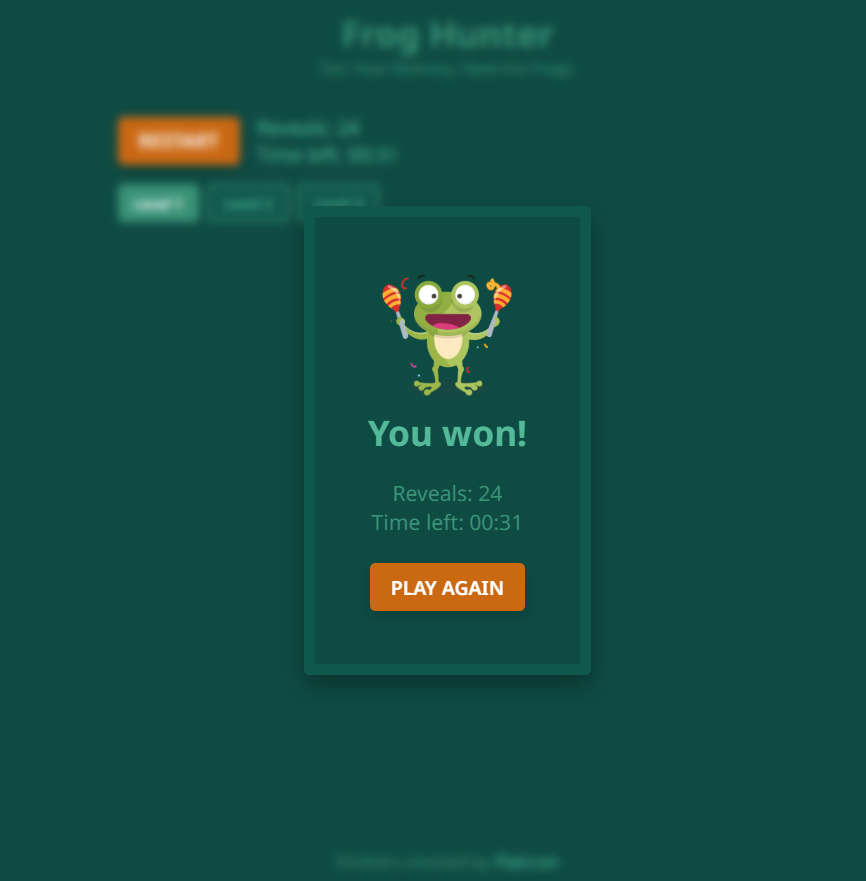
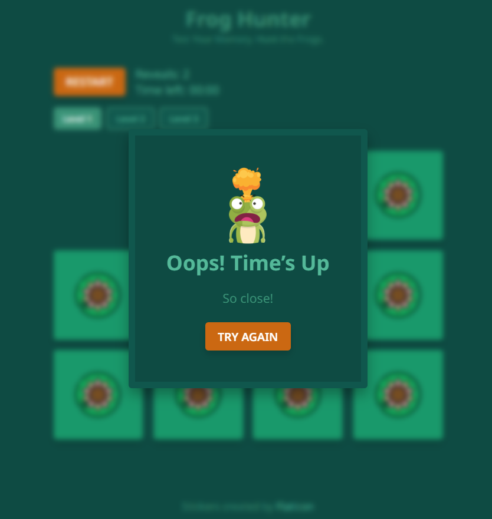
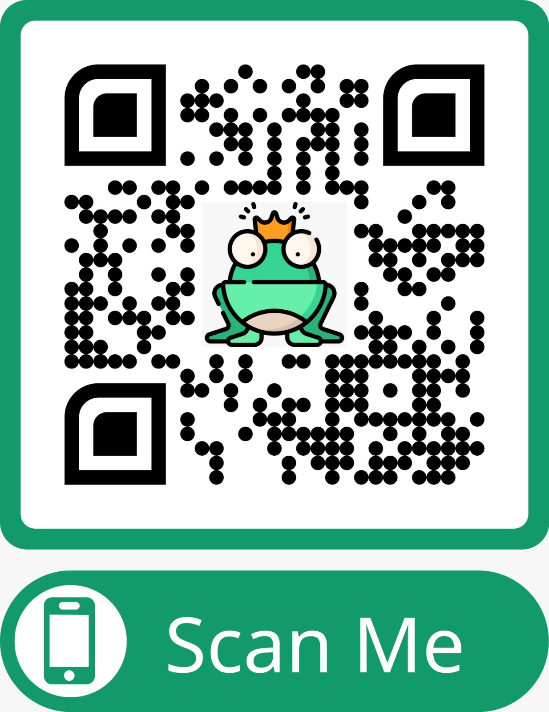

# 🐸 Frog Hunter – Memory Game

Frog Hunter is a browser-based memory game developed as part of the **Foundation Project at Hack Your Future**.
The project explores how a simple, familiar game can be built incrementally while introducing core frontend logic and a basic backend architecture.

The game is inspired by the classic Memory game: players reveal cards two at a time and try to find all matching pairs.
Over the course of the project, the implementation evolves from a purely frontend solution to a full-stack version where card data is served from a backend API.

This repository reflects that progression and the decisions made along the way.

---

## 🎮 About the Game

In Frog Hunter, players interact with a grid of frog-themed cards.

### Core mechanics:

- Cards start face down
- Players can reveal two cards at a time
- Revealed cards show their image
- Matching cards disappear from the board and are no longer interactive
- Not matching cards flip back after a short delay
- The game ends when all matching pairs are found
- A timer starts when the first card is revealed
- A counter tracks how many card reveals the player has made (a reveal is not the same as a click)
- Players can choose between multiple difficulty levels (easy, medium, hard)

### Future enhancements planned:

- Sound effects for flipping cards, matching pairs, and game end
- Scoring system: points per match, difficulty and time modifiers, and best score tracking
- Player name input: associate scores with a player
- Database-backed leaderboard: store top scores, filter by difficulty, and display top 10

The game logic is intentionally kept clear and predictable, focusing on state management, timing, and user feedback rather than complex visual effects.

---

## 🖼️ Screenshot of Gameplay



### 🖼️ Winner Modal



### 🖼️ Timeout Modal



---

## 🧠 Development Approach

The project follows a sprint-based, incremental approach:

### 1. Initial version

- Game logic implemented entirely in the frontend
- Cards hardcoded in JavaScript
- Focus on DOM manipulation and game state

### 2. Refactored version

- Card data moved to a backend API
- SQLite database introduced for persistence
- Frontend refactored to fetch card data dynamically
- Game logic remains fully client-side

This separation keeps responsibilities clear:

- **Frontend** → game logic, UI, state, timing
- **Backend** → data storage and retrieval only

---

## 🛠️ Technologies Used

### Frontend

- **HTML** — structure and semantic markup
- **CSS** — layout, visual styling, and basic responsiveness
- **JavaScript** — game logic, state handling, and DOM updates

### Backend

- **Node.js** — server runtime
- **Express.js** — REST API
- **SQLite** — lightweight relational database for card data

### Tooling

- **Git & GitHub** — version control and collaboration
- **npm** — dependency management and scripts
- **Postman** — API testing during development
- **VS Code** — development environment
- **Render** — cloud deployment platform

---

## 🔌 API Overview

The frontend fetches card data from a backend API.

`GET /cards`

Returns all available cards in JSON format.
Each card includes:

`- id`
`- name`
`- image`
`- alt`
`- color`

Example response:

```json
[
  {
    "id": 1,
    "name": "frog1",
    "image": "Images/frog1.png",
    "alt": "Frog smiling",
    "color": "#43bef7"
  }
]
```

The API was manually tested using Postman.
Valid endpoints return `200 OK`; invalid routes return `404 Not Found`.

---

## 🌍 Live Deployment

The project is deployed and publicly accessible at:

👉 https://froghunter.onrender.com/

The deployed version mirrors the local environment and includes:

- Fully functional frontend–backend communication
- Responsive layout
- Difficulty levels and timer
- Winner and timeout modals

A QR code is included below for quick mobile access.



---

## ▶️ How to Run the Project

### Backend

```bash
cd server
npm install
npm start
```

The server runs at:

```arduino
http://localhost:3000
```

### Frontend

Open `app/index.html` in your browser.
The game will fetch card data from the running backend server.

---

## 📂 Project Structure

```
frog hunter/
├── postman/                                            # Postman tests, collection and API evidence
  ├── collection/                                       # Exported Postman collection
│ ├── screenshots/                                      # Evidence of API responses and test results
│ │   ├── body-preview.png
│ │   └── test-results.png
│ └── postman-tests.md                                  # Documentation of Postman test scripts
|
├── app/                                                # Frontend application
| |── Images/                                           # Card images and visual assets
| │── index.html                                        # Main HTML file
| │── styles.css                                        # Application styles
| └── script.js                                         # Frontend logic
|
├── server/                                             # Backend
| ├── package.json                                      # Backend dependencies
| ├── package-lock.json                                 # Dependency lock file
| ├── index.js                                          # Express server and API routes
| ├── database.db                                       # SQLite database
| └── script-2.sql                                      # Database schema and seed data
|
└── README.md                                           # Project overview and setup instructions
```

The structure is intentionally simple to keep the focus on:

- game logic
- state management
- frontend–backend communication

---

## 📝 Notes & Decisions

- Card data is no longer hardcoded in the frontend.
- New cards can be added by updating the database without changing game logic.
- The backend remains minimal by design.
- A custom favicon was added to improve branding and browser tab identification.
- The layout was developed using a mobile-first approach.
- Base styles target small screens by default.
- Larger screen refinements are applied using min-width media queries (600px and above).
- This ensures optimal performance and usability on mobile devices, which represent the majority of web traffic.
- Image assets are credited in the UI.
- Matched cards are now visually hidden with a smooth animation, providing clear feedback when a pair is found.
- The 'matched' state ensures cards are both non-interactive and visually removed without affecting game logic or grid layout.
- Difficulty levels and countdown timer are implemented to enhance challenge.
- Future planned features include sound effects, scoring system, player name input, and leaderboard

---

## 👩🏻‍💻👩🏼‍💻 Team

This project was developed as a pair-programming exercise, emphasizing collaboration, communication, and shared ownership of the codebase.

- **Paloma Cardozo**
- **Iryna Lopatina**
